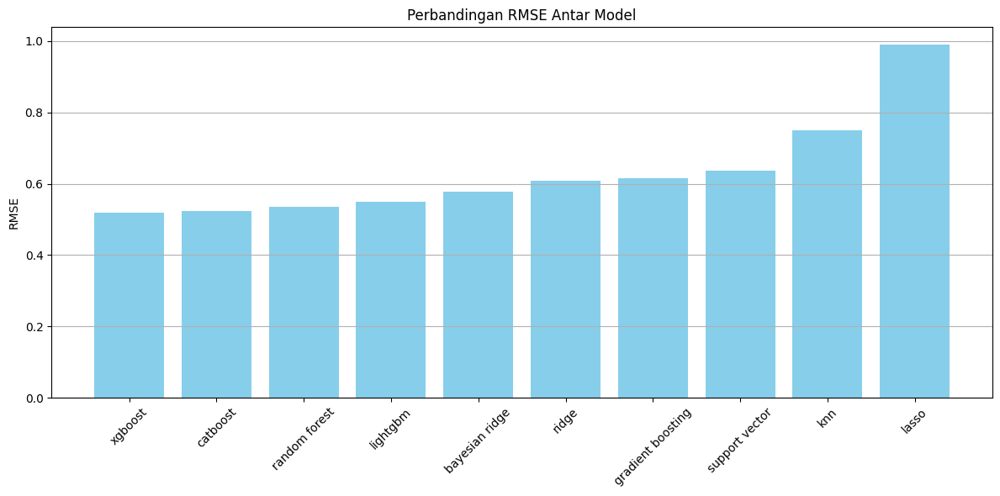
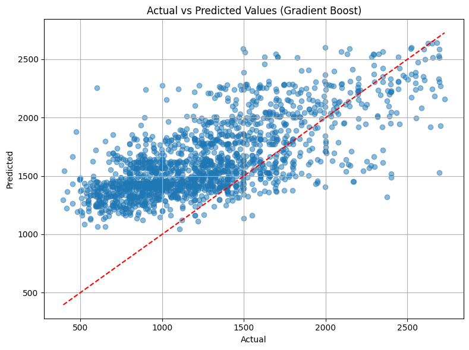

# 🏢 Prediksi Harga Sewa Apartemen [Ahmad Radesta]

Proyek ini bertujuan untuk membangun model prediktif berbasis machine learning guna memperkirakan harga sewa apartemen berdasarkan fitur-fitur properti seperti luas bangunan, jumlah kamar, kamar mandi, dan lokasi.

---

## 📌 1. Domain Proyek

Harga sewa properti merupakan variabel yang sangat dipengaruhi oleh banyak faktor: lokasi, ukuran, jumlah kamar, dan fasilitas. Penetapan harga secara manual seringkali tidak objektif dan rentan terhadap kesalahan estimasi.

Dalam proyek ini, kami mengangkat isu tersebut dan membangun sistem prediktif menggunakan data historis sebagai dasar penetapan harga.

> Referensi:  
> Si, R. & Lu, Min & Arikawa, Masatoshi & Asami, Yasushi & Iwasaki, J.. (2014). Finding Good Areas for Renting Apartments Using Apartments Information and Users' Trajectories. ISPRS - International Archives of the Photogrammetry, Remote Sensing and Spatial Information Sciences. XL-4. 10.5194/isprsarchives-XL-4-229-2014.

> Sirmans, G. & Benjamin, John. (1991). Determinants of Market Rent. Journal of Real Estate Research. 6. 357-380.
10.1080/10835547.1991.12090653.

---

## 🌟 2. Business Understanding

### Problem Statements
1. Harga sewa yang ditampilkan pada iklan sering kali tidak mencerminkan nilai pasar yang sebenarnya.
2. Pengguna (pemilik atau penyewa) kesulitan untuk menentukan apakah harga sewa suatu apartemen tergolong mahal atau murah berdasarkan karakteristiknya.

### Goals
1. Membangun model machine learning untuk memprediksi harga sewa apartemen berdasarkan fitur properti.
2. Membandingkan performa beberapa model regresi untuk menemukan model terbaik.
3. Mengidentifikasi fitur-fitur yang paling berpengaruh terhadap harga sewa apartemen.

### Solution Statement
- **Ridge Regression** dan **Lasso Regression**  
  Digunakan sebagai model baseline. Memberikan interpretasi yang sederhana dan cepat dilatih, serta dapat menangani multikolinearitas.
- **Random Forest Regressor**, **Gradient Boosting**, **XGBoost**, **CatBoost**, dan **LightGBM**  
  Digunakan untuk menangkap hubungan non-linear antar fitur dan target.
- **RMSE (Root Mean Squared Error)** digunakan sebagai metrik utama untuk mengevaluasi akurasi prediksi model.

---

## 📊 3. Data Understanding

### Informasi Dataset
- **Sumber:** [Apartments for Rent Classified - Kaggle](https://www.kaggle.com/datasets/adithyaawati/apartments-for-rent-classified)
- **File:** `apartments_for_rent_classified_10K.csv`
- **Jumlah baris:** 10.000
- **Jumlah kolom:** 22

| #   | Column         | Dtype   |
|-----|----------------|---------|
| 0   | id             | int64   |
| 1   | category       | object  |
| 2   | title          | object  |
| 3   | body           | object  |
| 4   | amenities      | object  |
| 5   | bathrooms      | float64 |
| 6   | bedrooms       | float64 |
| 7   | currency       | object  |
| 8   | fee            | object  |
| 9   | has_photo      | object  |
| 10  | pets_allowed   | object  |
| 11  | price          | int64   |
| 12  | price_display  | object  |
| 13  | price_type     | object  |
| 14  | square_feet    | int64   |
| 15  | address        | object  |
| 16  | cityname       | object  |
| 17  | state          | object  |
| 18  | latitude       | float64 |
| 19  | longitude      | float64 |
| 20  | source         | object  |
| 21  | time           | int64   |

Dataset mempunyai beberapa fitur yang terdapat missing value.
| | Tipe Data | Jumlah Missing Value |
|----------|----------|----------|
|amenities|object|3549
|bathrooms|float64|34
|bedrooms|float64|7
|pets_allowed|bject|4163
|address|object|3327
|cityname|object|77
|state|object|77
|latitude|float64|10
|longitude|float64|10

### Deskripsi Fitur:
| Fitur         | Deskripsi                                  |
|--------------|---------------------------------------------|
| `id`         | ID unik untuk setiap listing                |
| `category`   | Kategori properti (apartment, etc.)         |
| `title`      | Judul listing                               |
| `body`       | Deskripsi listing                           |
| `price`      | Harga sewa apartemen (target)               |
| `bedrooms`   | Jumlah kamar tidur                          |
| `bathrooms`  | Jumlah kamar mandi                          |
| `sqfeet`     | Luas apartemen dalam satuan kaki persegi    |
| `amenities`  | Daftar fasilitas                            |
| `currency`   | Mata uang yang digunakan                    |
| `fee`        | Biaya tambahan selain harga sewa utama      |
| `has_photo`  | Apakah listing memiliki foto                |
| `pets_allowed`| Apakah hewan peliharaan diperbolehkan      |
| `price_display`| Format tampilan harga                     |
| `price_type` | Jenis harga (per bulan/tahun)              |
| `address`    | Alamat properti                             |
| `cityname`   | Kota                                       |
| `state`      | Negara bagian/wilayah                      |
| `latitude`   | Koordinat geografis                        |
| `longitude`  | Koordinat geografis                        |
| `source`     | Platform sumber listing                     |
| `time`       | Waktu pengambilan data                      |

### Kondisi Data
- Missing value terdapat pada kolom: `amenities`, `pets_allowed`, dan `address`.
- Kolom `fee` tidak memiliki missing value.
- Distribusi harga sewa sangat skewed dan terdapat outlier.

### EDA (Exploratory Data Analysis)
- Visualisasi distribusi `price` dan `sqfeet`
- Korelasi antara `bedrooms`, `bathrooms`, dan `price`
- Frekuensi kata dalam kolom `amenities`

---

## 🧹 4. Data Preparation

1. **Penanganan Missing Value**:  
   - Kolom `amenities`, `pets_allowed`, dan `address` diisi dengan nilai "tidak tersedia" menggunakan `fillna()`.

2. **Penghapusan Kolom Tidak Relevan**:  
   - Kolom seperti `id`, `category`, `title`, `body`, `currency`, `fee`, `price_display`, `price_type`, `address`, `latitude`, `longitude`, dan `time` dihapus karena tidak relevan atau redundan.

3. **Penghapusan Outlier**:
   - Menggunakan metode **IQR (Interquartile Range)** untuk mendeteksi dan menghapus outlier dari fitur numerik seperti `price`, `sqfeet`, dll.

4. **Encoding Fitur Kategorikal**:
   - Fitur `cityname`, `state`, `has_photo`, `pets_allowed`, dan `amenities` diubah menjadi format numerik menggunakan One-Hot Encoding.

5. **Transformasi Target**:
   - Kolom `price` ditransformasikan menggunakan `PowerTransformer` untuk mengurangi skewness.

6. **Pembagian Dataset**:
   - Menggunakan `train_test_split` dengan rasio 80:20 untuk pelatihan dan pengujian.

7. **Normalisasi Fitur Numerik**:
   - Data seperti `sqfeet`, `bedrooms`, `bathrooms` dinormalisasi menggunakan `StandardScaler`.

---

## 🤖 5. Modeling

### Algoritma yang Digunakan:

- **K-Nearest Neighbors (KNN)**: Memprediksi berdasarkan rata-rata K tetangga terdekat.  
  `n_neighbors = 4`

- **Ridge Regression**: Regresi linear dengan regularisasi L2 untuk mengurangi multikolinearitas.

- **Lasso Regression**: Regresi linear dengan regularisasi L1 untuk seleksi fitur otomatis.

- **Random Forest Regressor**: Model ensemble berbasis pohon dengan prediksi berbasis voting rata-rata.

- **Gradient Boosting**: Membangun pohon bertahap berdasarkan residual error sebelumnya.

- **XGBoost Regressor**: Gradient boosting yang efisien dengan pruning dan regularisasi.

- **CatBoost Regressor**: Boosting model yang sangat efisien menangani data kategorikal.

- **LightGBM Regressor**: Gradient boosting yang cepat dengan histogram binning.

- **Bayesian Ridge Regression**: Regresi probabilistik dengan regularisasi berbasis prior distribusi.

- **Support Vector Regressor (SVR)**: Menggunakan margin epsilon untuk memprediksi target dalam batas tertentu.

### Parameter
- Mayoritas model menggunakan parameter default.
- Beberapa parameter seperti `n_estimators`, `max_depth`, dan `learning_rate` diatur secara manual untuk XGBoost dan Random Forest.

---

## 📏 6. Evaluation

### Metrik yang Digunakan:
- **RMSE (Root Mean Squared Error)**: Rata-rata kuadrat error, sensitif terhadap outlier.
- **MAE (Mean Absolute Error)**: Rata-rata selisih absolut antara aktual dan prediksi.
- **R² Score**: Proporsi variasi target yang bisa dijelaskan oleh model.

### Hasil Evaluasi:

| No | Model              | RMSE     | MAE      | R² Score  |
|----|--------------------|----------|----------|-----------|
| 1  | XGBoost            | 0.5191   | 0.3762   | 0.7245    |
| 2  | CatBoost           | 0.5241   | 0.3838   | 0.7192    |
| 3  | LightGBM           | 0.5501   | 0.3991   | 0.6907    |
| 4  | Gradient Boosting  | 0.6161   | 0.4645   | 0.6120    |
| 5  | Lasso              | 0.9890   | 0.7774   | -0.0000   |
| 6  | Random Forest      | 0.5351   | 0.3802   | 0.7073    |
| 7  | Bayesian Ridge     | 0.5766   | 0.4080   | 0.6601    |
| 8  | Support Vector     | 0.6373   | 0.4530   | 0.5849    |
| 9  | K-Nearest Neighbors| 0.7499   | 0.5507   | 0.4252    |
|10  | Ridge              | 0.6077   | 0.4203   | 0.6225    |

### Kesimpulan:
- **XGBoost** memiliki performa terbaik berdasarkan RMSE dan R² Score.
- **CatBoost** dan **Random Forest** juga kompetitif.
- **Lasso Regression** berkinerja buruk dan tidak direkomendasikan.
- Perlu tuning parameter lebih lanjut untuk hasil optimal.

