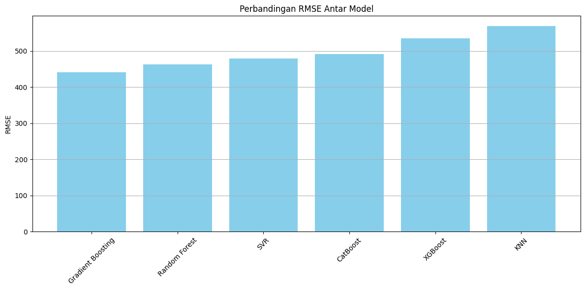

# 🏢 Prediksi Harga Sewa Apartemen [Ahmad Radesta]

Proyek ini bertujuan untuk membangun model prediktif berbasis machine learning guna memperkirakan harga sewa apartemen berdasarkan fitur-fitur properti seperti luas bangunan, jumlah kamar, kamar mandi, dan lokasi.

---

## 📌 1. Domain Proyek

Harga sewa properti merupakan variabel yang sangat dipengaruhi oleh banyak faktor: lokasi, ukuran, jumlah kamar, dan fasilitas. Penetapan harga secara manual seringkali tidak objektif dan rentan terhadap kesalahan estimasi.

Dalam proyek ini, kami mengangkat isu tersebut dan membangun sistem prediktif menggunakan data historis sebagai dasar penetapan harga.

> Referensi:  
> Si, R. & Lu, Min & Arikawa, Masatoshi & Asami, Yasushi & Iwasaki, J.. (2014). Finding Good Areas for Renting Apartments Using Apartments Information and Users' Trajectories. ISPRS - International Archives of the Photogrammetry, Remote Sensing and Spatial Information Sciences. XL-4. 10.5194/isprsarchives-XL-4-229-2014.

> Sirmans, G. & Benjamin, John. (1991). Determinants of Market Rent. Journal of Real Estate Research. 6. 357-380.
10.1080/10835547.1991.12090653.

---

## 🌟 2. Business Understanding

### Problem Statements
1. Harga sewa yang ditampilkan pada iklan sering kali tidak mencerminkan nilai pasar yang sebenarnya.
2. Pengguna (pemilik atau penyewa) kesulitan untuk menentukan apakah harga sewa suatu apartemen tergolong mahal atau murah berdasarkan karakteristiknya.

### Goals
1. Membangun model machine learning untuk memprediksi harga sewa apartemen berdasarkan fitur properti.
2. Membandingkan performa beberapa model regresi untuk menemukan model terbaik.
3. Mengidentifikasi fitur-fitur yang paling berpengaruh terhadap harga sewa apartemen.

### Solution Statement
- **Ridge Regression** dan **Lasso Regression**  
  Digunakan sebagai model baseline. Memberikan interpretasi yang sederhana dan cepat dilatih, serta dapat menangani multikolinearitas.
- **Random Forest Regressor**, **Gradient Boosting**, **XGBoost**, **CatBoost**, dan **LightGBM**  
  Digunakan untuk menangkap hubungan non-linear antar fitur dan target.
- **RMSE (Root Mean Squared Error)** digunakan sebagai metrik utama untuk mengevaluasi akurasi prediksi model.

---

## 📊 3. Data Understanding

### Informasi Dataset
- **Sumber:** [Apartments for Rent Classified - Kaggle](https://www.kaggle.com/datasets/adithyaawati/apartments-for-rent-classified)
- **File:** `apartments_for_rent_classified_10K.csv`
- **Jumlah baris:** 10.000
- **Jumlah kolom:** 22

| #   | Column         | Dtype   |
|-----|----------------|---------|
| 0   | id             | int64   |
| 1   | category       | object  |
| 2   | title          | object  |
| 3   | body           | object  |
| 4   | amenities      | object  |
| 5   | bathrooms      | float64 |
| 6   | bedrooms       | float64 |
| 7   | currency       | object  |
| 8   | fee            | object  |
| 9   | has_photo      | object  |
| 10  | pets_allowed   | object  |
| 11  | price          | int64   |
| 12  | price_display  | object  |
| 13  | price_type     | object  |
| 14  | square_feet    | int64   |
| 15  | address        | object  |
| 16  | cityname       | object  |
| 17  | state          | object  |
| 18  | latitude       | float64 |
| 19  | longitude      | float64 |
| 20  | source         | object  |
| 21  | time           | int64   |

Dataset mempunyai beberapa fitur yang terdapat missing value.
| | Tipe Data | Jumlah Missing Value |
|----------|----------|----------|
|amenities|object|3549
|bathrooms|float64|34
|bedrooms|float64|7
|pets_allowed|bject|4163
|address|object|3327
|cityname|object|77
|state|object|77
|latitude|float64|10
|longitude|float64|10

### Deskripsi Fitur:
| Fitur         | Deskripsi                                  |
|--------------|---------------------------------------------|
| `id`         | ID unik untuk setiap listing                |
| `category`   | Kategori properti (apartment, etc.)         |
| `title`      | Judul listing                               |
| `body`       | Deskripsi listing                           |
| `price`      | Harga sewa apartemen (target)               |
| `bedrooms`   | Jumlah kamar tidur                          |
| `bathrooms`  | Jumlah kamar mandi                          |
| `sqfeet`     | Luas apartemen dalam satuan kaki persegi    |
| `amenities`  | Daftar fasilitas                            |
| `currency`   | Mata uang yang digunakan                    |
| `fee`        | Biaya tambahan selain harga sewa utama      |
| `has_photo`  | Apakah listing memiliki foto                |
| `pets_allowed`| Apakah hewan peliharaan diperbolehkan      |
| `price_display`| Format tampilan harga                     |
| `price_type` | Jenis harga (per bulan/tahun)              |
| `address`    | Alamat properti                             |
| `cityname`   | Kota                                       |
| `state`      | Negara bagian/wilayah                      |
| `latitude`   | Koordinat geografis                        |
| `longitude`  | Koordinat geografis                        |
| `source`     | Platform sumber listing                     |
| `time`       | Waktu pengambilan data                      |

### Kondisi Data
- Missing value terdapat pada kolom: `amenities`, `pets_allowed`, dan `address`.
- Kolom `fee` tidak memiliki missing value.
- Distribusi harga sewa sangat skewed dan terdapat outlier.

### EDA (Exploratory Data Analysis)
- Visualisasi distribusi `price` dan `sqfeet`
- Korelasi antara `bedrooms`, `bathrooms`, dan `price`
- Frekuensi kata dalam kolom `amenities`

---

# 🧹 Data Preparation

Tahapan data preparation dilakukan untuk memastikan data yang digunakan dalam pelatihan model bersih, relevan, dan dalam format yang sesuai dengan kebutuhan algoritma machine learning.

---

## 🔧 Teknik yang Digunakan

- **Handling Missing Values**  
  Menghapus atau mengisi nilai kosong untuk menjaga integritas data.

- **Removing Outliers**  
  Menghapus nilai ekstrem pada kolom numerik untuk mencegah distorsi model.

- **Dropping Irrelevant Features**  
  Menghapus fitur yang tidak memiliki kontribusi prediktif atau memiliki nilai yang seragam.

- **Encoding Categorical Variables**  
  Mengubah variabel kategorikal menjadi format numerik menggunakan *One-Hot Encoding*.

- **Train-Test Split**  
  Membagi dataset menjadi data latih dan uji dengan rasio 80:20.

- **Feature Scaling**  
  Melakukan standarisasi nilai pada fitur numerik agar semua fitur memiliki skala yang setara menggunakan `StandardScaler`.

---

## 🧪 Rincian Proses Data Preparation

- Fitur dengan **jumlah missing value < 100** dihapus dari dataset.
- Fitur dengan **jumlah missing value > 1000** dilakukan imputasi.
- Outlier diatasi menggunakan metode **Interquartile Range (IQR)**.
- Fitur `id`, `latitude`, `longitude`, dan `time` dihapus karena tidak memberikan nilai tambah secara prediktif.
- Fitur `category`, `currency`, `fee`, dan `price_type` dihapus karena memiliki nilai yang sama di seluruh baris data.
- Fitur kategorikal dikonversi menggunakan **One-Hot Encoding**.
- Dataset dibagi menjadi:
  
  | Jenis Dataset  | Jumlah |
  |----------------|--------|
  | Keseluruhan    | 8,136  |
  | Data Latih     | 6,508  |
  | Data Uji       | 1,628  |

- Skala fitur numerik dinormalisasi menggunakan **StandardScaler** pada data latih dan data uji.

---

## 🎯 Alasan Dilakukannya Tahapan Ini

- **Mengatasi Missing Values**  
  Untuk menghindari error saat proses training model.

- **Menghapus Outlier**  
  Untuk meningkatkan akurasi model dan menghindari bias akibat nilai ekstrem.

- **Menghapus Fitur Tak Relevan**  
  Untuk menyederhanakan model dan mengurangi beban komputasi.

- **Encoding Variabel Kategorikal**  
  Agar data dapat diproses oleh algoritma yang hanya menerima input numerik.

- **Pembagian Data 80:20**  
  Untuk memastikan data latih cukup besar, sekaligus menyediakan data uji yang representatif.

- **Standarisasi Fitur**  
  Agar model tidak bias terhadap fitur yang memiliki skala lebih besar.

---

## 🤖 5. Modeling

## 🔍 Model yang Digunakan

### 🔹 Support Vector Regression (SVR)
- **Parameter:** default
- **Deskripsi:** Memproyeksikan data ke dimensi yang lebih tinggi untuk menemukan hyperplane terbaik dalam margin error tertentu. Cocok untuk regresi non-linear.

---

### 🔹 K-Nearest Neighbors (KNN)
- **Parameter:** `n_neighbors=4`
- **Deskripsi:** Melakukan prediksi berdasarkan rata-rata nilai dari 4 tetangga terdekat berdasarkan jarak euclidean atau metrik lainnya.

---

### 🔹 Random Forest
- **Parameter:** `random_state=42`
- **Deskripsi:** Merupakan ensemble dari banyak pohon keputusan. Mengurangi overfitting dan meningkatkan akurasi dengan menggunakan data acak dan fitur subset.

---

### 🔹 Gradient Boosting
- **Parameter:** `random_state=42`
- **Deskripsi:** Metode boosting yang membangun model secara iteratif, setiap model memperbaiki kesalahan dari model sebelumnya.

---

### 🔹 XGBoost
- **Parameter:** `verbosity=0`, `random_state=42`
- **Deskripsi:** Implementasi boosting yang cepat dan efisien, dengan kemampuan regularisasi (L1/L2) untuk menghindari overfitting.

---

### 🔹 CatBoost
- **Parameter:** `verbose=0`, `random_state=42`
- **Deskripsi:** Algoritma boosting yang optimal untuk data kategorikal dan tidak memerlukan preprocessing yang kompleks.

---

## ✅ Kelebihan dan Kekurangan Setiap Model

### SVR
- **Kelebihan:**
  - Cocok untuk data non-linear.
  - Bisa dikontrol menggunakan parameter epsilon.
- **Kekurangan:**
  - Lambat saat digunakan pada dataset besar.
  - Sangat sensitif terhadap skala fitur.

---

### KNN
- **Kelebihan:**
  - Simpel dan mudah dipahami.
  - Tidak membutuhkan proses pelatihan eksplisit.
- **Kekurangan:**
  - Tidak efisien untuk dataset besar.
  - Sensitif terhadap outlier dan skala fitur.

---

### Random Forest
- **Kelebihan:**
  - Akurat dan tahan terhadap overfitting.
  - Cocok untuk data kompleks dan beragam.
- **Kekurangan:**
  - Kurang interpretatif.
  - Membutuhkan sumber daya komputasi lebih besar.

---

### Gradient Boosting
- **Kelebihan:**
  - Akurasi tinggi.
  - Efektif dalam menangani outlier.
- **Kekurangan:**
  - Membutuhkan tuning hyperparameter.
  - Proses pelatihan relatif lambat.

---

### XGBoost
- **Kelebihan:**
  - Sangat efisien dan cepat.
  - Mendukung regularisasi (L1, L2).
- **Kekurangan:**
  - Pengaturan parameter cukup kompleks.

---

### CatBoost
- **Kelebihan:**
  - Dapat menangani data kategorikal tanpa encoding manual.
  - Minim kebutuhan preprocessing.
- **Kekurangan:**
  - Dokumentasi lebih terbatas dibanding XGBoost.
  - Waktu pelatihan awal bisa lebih lambat.

---

## 📏 6. Evaluation

### Metrik yang Digunakan:
- **RMSE (Root Mean Squared Error)**: Rata-rata kuadrat error, sensitif terhadap outlier.
- **MAE (Mean Absolute Error)**: Rata-rata selisih absolut antara aktual dan prediksi.
- **R² Score**: Proporsi variasi target yang bisa dijelaskan oleh model.

### Hasil Evaluasi:

## 🧪 Tabel Hasil Evaluasi

| No | Model              |     RMSE     |     MAE      | R² Score  |
|----|--------------------|--------------|--------------|-----------|
| 1  | Gradient Boosting  | **441.08**   | 372.08       | 0.1231    |
| 2  | Random Forest      | 463.08       | 385.64       | 0.0335    |
| 3  | SVR                | 479.37       | **372.03**   | -0.0358   |
| 4  | CatBoost           | 490.86       | 420.44       | -0.0860   |
| 5  | XGBoost            | 534.93       | 462.75       | -0.2898   |
| 6  | KNN                | 568.38       | 479.07       | -0.4561   |

---

## 📌 Kesimpulan

- **Gradient Boosting** menunjukkan performa terbaik secara keseluruhan dengan nilai **RMSE dan R² Score tertinggi** di antara semua model.
- **SVR** memiliki **MAE terendah**, menunjukkan error rata-rata prediksi yang kecil secara absolut, meskipun R²-nya negatif.
- **KNN** dan **XGBoost** memiliki performa paling rendah berdasarkan semua metrik, menunjukkan bahwa model ini kurang cocok untuk dataset ini tanpa tuning lebih lanjut.

